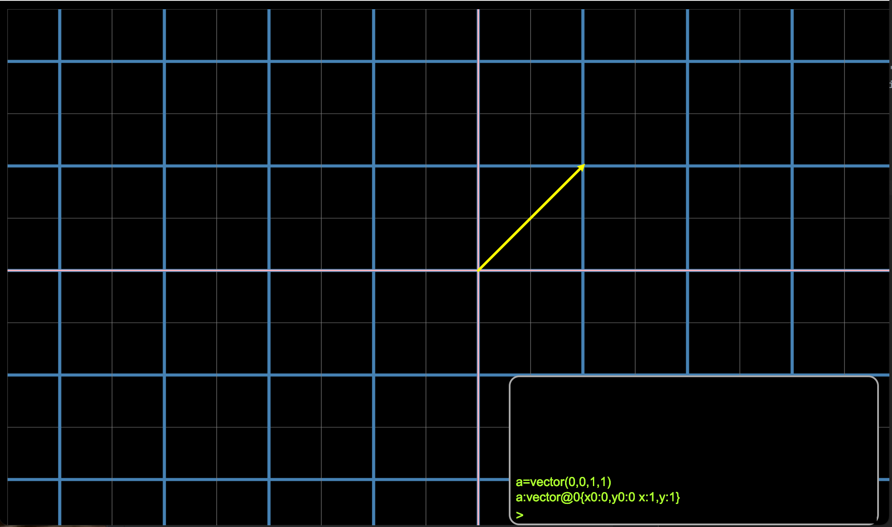

**MatRepl**
* is a Matrix
* and a repl: Read–Eval–Print Loop, where Print is doing operations on vectors and matrices in a graphic environment
* written in vanilla javascript

</img>
  
The repl has the following syntax (It's work in progress, new capabilities will be added)
* arithmetic expressions:
  * add, subtract, divide, multiply
* variable declaration eg: a= ...
* vector(1,2,3,4) adds a vector
  * > &gt; vector@0{x0:1, y0: 2, x:3, y:4}
* remove(x) removes bindings (when it's an object (eg vector), removes it from the matrix)
* remove(@x) removes an object using it's assigned index 
* method calls:
  * a = vector(0,0,12,1)
  * a.type()
  * > &gt; vector
* property lookup
  * a.x
  * > 12
  